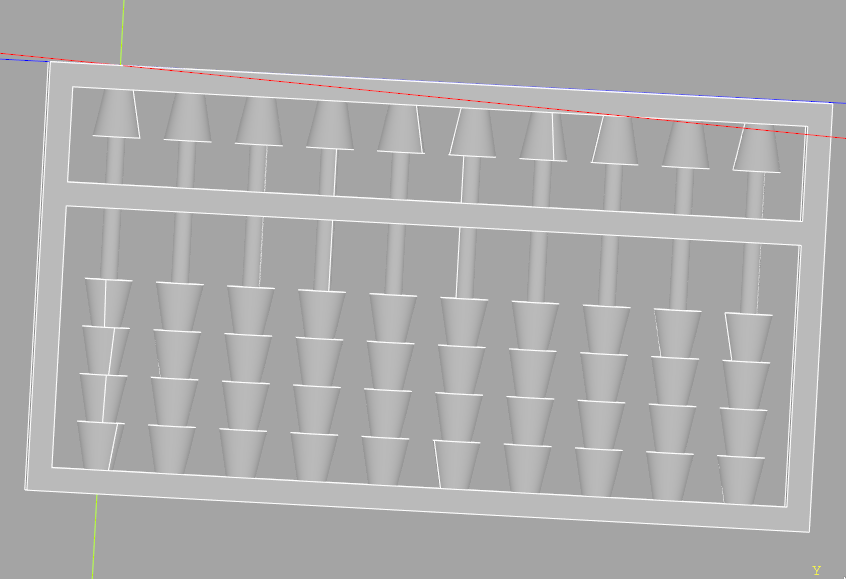
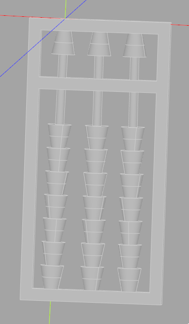
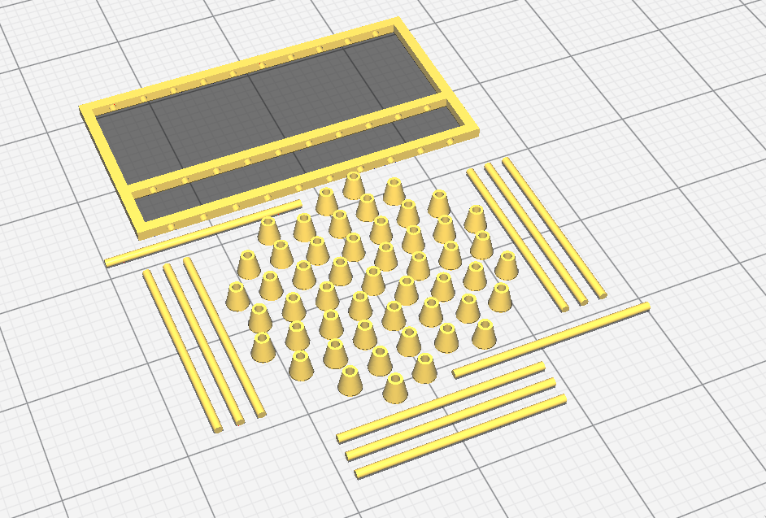

# A parametric soroban written in CADQuery

The purpose of this project is to demonstrate how "code CAD" can be intuitive to
learn.

See `soroban.py` for a self-contained example.

See `src/` files for realistic structuring of a code CAD project.

Splitting up parts into their own files makes them reusable across designs and
allows for easy modification.

Here are a couple pictures of the soroban:

How it'd look in a slicer:

# Usage

Follow the CADQuery installation instructions, and open the soroban.py file.

Adjust the variables at the top of the file to generate new, interesting models.

# Printing

Use the AMF files generated by the project to 3D print.

# License

This project is protected by the PolyForm Noncommercial license. This basically
means:

* You must include this same license in derivatives.
* You must NOT use this project and its derivatives for commercial purposes.

License violators will not be tolerated.

